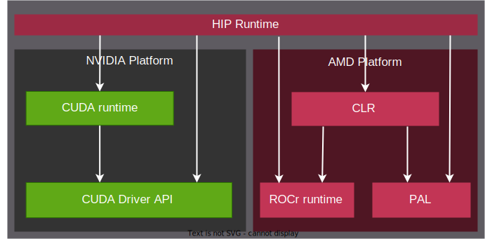

.. meta::
  :description: This chapter describes the HIP runtime API and the compilation workflow of the HIP compilers.
  :keywords: AMD, ROCm, HIP, CUDA, HIP runtime API

*******************************************************************************
Programming interface
*******************************************************************************

The programming interface document will focus on the HIP runtime API. The runtime API provides C and C++ functions for event, stream,  device and memory managements, etc. The HIP runtime on AMD platform uses the Common Language Runtimes (CLR), while on NVIDIA platform HIP runtime is only a thin layer over the CUDA runtime.

- **CLR** contains source codes for AMD's compute languages runtimes: ``HIP`` and ``OpenCL™``. CLR includes the implementation of ``HIP`` language on the AMD platform `hipamd <https://github.com/ROCm/clr/tree/develop/hipamd>`_ and the Radeon Open Compute Common Language Runtime (rocclr). rocclr is a virtual device interface, that HIP runtime interact with different backends such as ROCr on Linux or PAL on Windows. (CLR also include the implementation of `OpenCL <https://github.com/ROCm/clr/tree/develop/opencl>`_, while it's interact with ROCr and PAL)
- **CUDA runtime** is built over the CUDA driver API (lower-level C API). For further information about the CUDA driver and runtime API, check the :doc:`hip:how-to/hip_porting_driver_api`. On non-AMD platform, HIP runtime determines, if CUDA is available and can be used. If available, HIP_PLATFORM is set to ``nvidia`` and underneath CUDA path is used.

.. I am not sure we should share this.
The different runtimes interactions are represented on the following figure.

HIP compilers
=============

The HIP runtime API and HIP C++ extensions are available with HIP compilers. On AMD platform ROCm currently provides two compiler interfaces: ``hipcc`` and ``amdclang++``. The ``hipcc`` command-line interface aims to provide a more familiar user interface to users who are experienced in CUDA but relatively new to the ROCm/HIP development environment. On the other hand, ``amdclang++`` provides a user interface identical to the clang++ compiler. (For further details, check `llvm <llvm-project-docs:index>`_). On NVIDIA platform ``hipcc`` invoke the locally installed ``NVCC`` compiler, while on AMD platform it's invoke ``amdclang++``.

.. Need to update the link later.
For AMD compiler options, check the `GPU compiler option page <https://rocm.docs.amd.com/en/docs-5.2.3/reference/rocmcc/rocmcc.html#amd-gpu-compilation>`_.

HIP compilation workflow
------------------------

The source code compiled with HIP compilers are separated to device code and host. The HIP compilers:

.. WIP

* Compiling the device code into an assembly.
* Modify the host code by replacing the <<<...>>> syntax introduced in Kernels by the necessary CUDA runtime function calls to load and launch each compiled kernel from the PTX code and/or cubin object.

``NVCC`` and ``amdclang++`` target different architectures and use different code object formats: ``NVCC`` is ``cubin`` or ``ptx`` files, while the ``amdclang++`` path is the ``hsaco`` format.

For example of compiling from command line, check the :ref:` SAXPY tutorial compiling <compiling_on_the_command_line>`.

HIP runtime API
===============