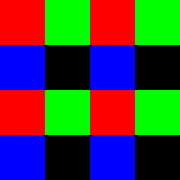

.. meta::
  :description: This chapter describes the texture fetching modes of the HIP ecosystem
  ROCm software.
  :keywords: AMD, ROCm, HIP, Texture, Texture Fetching

*******************************************************************************
Texture Fetching
*******************************************************************************

`Textures <doxygen/html/group___texture>`_ are more than just a buffer, that is interpreted as 1D, 2D or 3D array. Because of their legacy as a graphics functionality, textures are indexed with floating-point values. This can happen two different ways, either the index will be in the range of [0..size-1] or in [0..1]. The difference is mathematically just a division, so for the explanations on this page, we'll use the [0..size-1] indices.

Using floating-point indices isn't trivial. The two issues that come up are sampling and addressing.

When a texture is indexed with a fraction, the queried value is often between two or more texels (texture elements). The sampling method defines what value to return in these cases.

Sometimes the index is outside the bounds of the texture. This might seem unintuitive, but is useful in computer graphics for putting a texture on a surface multiple times, or just creating a visible sign of out of bounds indexing. The addressing mode defines what value to return when indexing a texture out of bounds.

There are several different sampling and addressing modes, the differences between which are described in the following.

This image is the texture, that will be used as for the examples below. It is 2x2 texels and is indexed in the [0..1] range.

.. image:: ../data/understand/textures/original.png
  :width: 150
  :alt: Texture used as example

Texture used as example

.. _texture_fetching_nearest:
Nearest point sampling
===============================================================================

In this mode the ``tex(x) = T[floor(x)]`` and similarly for 2D and 3D variants. This doesn't interpolate between neighboring values, which results in a pixelated look.

This image is the example texture stretched out to a 4x4 pixel quad, but still indexed in the [0..1] range. The in between values are the same as the values of the nearest texel.

.. image:: ../data/understand/textures/nearest.png
  :width: 300
  :alt: Texture upscaled with nearest point sampling

Texture upscaled with nearest point sampling

.. _texture_fetching_linear:
Linear filtering
===============================================================================

The linear filtering method simply does a linear interpolation between values.

* For one dimensional textures it is ``tex(x) = (1-α)T[i] + αT[i+1]``
* For two dimensional textures it is ``tex(x,y) = (1-α)(1-β)T[i,j] + α(1-β)T[i+1,j] + (1-α)βT[i,j+1] + αβT[i+1,j+1]``
* For three dimensional textures it is ``tex(x,y,z) = (1-α)(1-β)(1-γ)T[i,j,k] + α(1-β)(1-γ)T[i+1,j,k] + (1-α)β(1-γ)T[i,j+1,k] + αβ(1-γ)T[i+1,j+1,k] + (1-α)(1-β)γT[i,j,k+1] + α(1-β)γT[i+1,j,k+1] + (1-α)βγT[i,j+1,k+1] + αβγT[i+1,j+1,k+1]``

Where ``x, y, z`` are the floating-point indices, ``i, j, k`` are the integer indices and ``α, β, γ`` values represent how far along the sampled point is on the three axes. These values are calculated by these formulas: ``i = round(x')``, ``α = frac(x')``, ``x' = x - 0.5``, ``j = round(y')``, ``β = frac(y')``, ``y' = y - 0.5``, ``k = round(z')``, ``γ = frac(z')`` and ``z' = z - 0.5``

This image is the example texture stretched out to a 4x4 pixel quad, but still indexed in the [0..1] range. The in between values are interpolated between the neighboring texels.

.. image:: ../data/understand/textures/linear.png
  :width: 300
  :alt: Texture upscaled with linear filtering

Texture upscaled with linear filtering

.. _texture_fetching_border:
Address mode border
===============================================================================

This is probably the simplest address mode. When indexing out of bounds, the texture fetching returns a border value. This has to be set before texture fetching.

This image is the example texture on a 4x4 pixel quad indexed in the [0..3] range. The out of bounds values are the border color, which is yellow.

Texture with yellow border color

.. _texture_fetching_wrap:
Address mode wrap
===============================================================================

This addressing mode is very simple. Mathematically it uses modulo of the index.

``tex(x) = T[x mod (size-1)]``

This creates a repeating image effect.

This image is the example texture on a 4x4 pixel quad indexed in the [0..3] range. The out of bounds values are repeating the original texture.

Texture with wrap addressing

.. _texture_fetching_mirror:
Address mode mirror
===============================================================================

Similar to wrapping mirror mode also creates a repeating image, but this time neighboring instances are mirrored.

This image is the example texture on a 4x4 pixel quad indexed in the [0..3] range. The out of bounds values are repeating the original texture, but mirrored.

.. image:: ../data/understand/textures/mirror.png
  :width: 300
  :alt: Texture with mirror addressing

Texture with mirror addressing

.. _texture_fetching_clamp:
Address mode clamp
===============================================================================

This mode simply clamps the index to be between [0..size-1]. This means that when indexing out of bounds, the values on the edge of the texture will repeat.

This image is the example texture on a 4x4 pixel quad indexed in the [0..3] range. The out of bounds values are repeating the values at the edge of the texture.

Texture with clamp addressing
